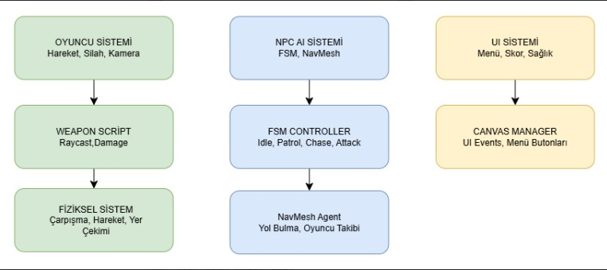

# 🎯 Last Warrior: Yapay Zeka Destekli TPS(Third Person Shooter) Oyunu

## Proje Tanımı
Bu proje, Unity oyun motoru kullanılarak geliştirilen **"Last Warrior"** adında bir Third Person Shooter (TPS) oyunudur. Proje, oyuncuya üçüncü şahıs bakış açısından bir karakteri kontrol etme imkanı sunar. Oyunun teknik omurgasını, temel TPS mekanikleri (hareket, siper alma, nişan alma) ve düşman davranışlarını yöneten Finite State Machine (FSM) tabanlı bir yapay zekâ mimarisi oluşturmaktadır.

## Proje Amacı

Bu projenin temel amacı; Unity ortamında baştan sona işlevsel bir TPS oyun prototipi oluşturmaktır. Bu hedefe ulaşmak için aşağıdaki alt amaçlar belirlenmiştir:

*Akıcı ve tepkisel bir üçüncü şahıs karakter kontrol sistemi geliştirmek.

*Finite State Machine (FSM) kullanarak, oyuncunun eylemlerine dinamik olarak tepki verebilen (Devriye Gezme, Takip Etme, Saldırma) bir düşman yapay zekâsı kodlamak.

*Temel oyun döngüsünü (görev başlangıcı, çatışma, hedef tamamlama, görev sonu) eksiksiz bir şekilde uygulamak.

*Oyunun geçtiği "Eski Depo" atmosferini yansıtacak bir seviye tasarımı ve kullanıcı arayüzü (UI) oluşturmak.

## 🪖 Oyun Hakkında

**Tür:** Third Person Shooter (TPS)  
**Motor:** Unity  
**Dil:** C#  
**Tema:** Aksiyon, Operasyon 

## 🎬 Senaryo

Hikaye, "Eski Depo" olarak bilinen, unutulmuş bir bölgede geçmektedir. Oyuncu, bu terk edilmiş depoyu korumakla yükümlüdür. Ancak, depo sessiz değildir. Bölgeyi kendi kalesi haline getirmek isteyen düşmanlar tarafından işgal edilecektir. Oyuncu, bu bölgeyi düşman saldırılarından koruyarak hayatta kalma mücadelesi verecektir. 

## 🤖 Yapay Zekâ Sistemi

Oyundaki düşman NPC’ler, **Finite State Machine (FSM)** yaklaşımı ile kontrol edilir.  
Her düşman, duruma göre farklı davranışlar sergiler:

| Durum | Açıklama |
|--------|-----------|
| **Idle** | NPC devriye sırasını bekler veya çevresini gözlemler. |
| **Patrol** | Belirlenen `Waypoints` arasında devriye gezer. |
| **Chase** | Oyuncu tespit edildiğinde peşine düşer. |
| **Attack** | Oyuncu menzile girdiğinde saldırıya geçer. |
| **Die** | Sağlığı tükendiğinde devre dışı kalır. |

FSM sistemi, **esnek** ve **ölçeklenebilir** bir AI altyapısı sağlar.

## 🧱 Oyun Mekanikleri

- **TPS Kamera Kontrolü:** Omuz üzerinden nişan alma sistemi.  
- **Silah Mekaniği:** Nişan alma, ateş etme, mermi ve geri tepme (recoil) simülasyonu.  
- **FSM Tabanlı NPC AI:** Düşmanlar çevreye ve oyuncuya dinamik olarak tepki verir.  
- **Health Sistemi:** Oyuncu ve NPC’ler için hasar ve ölüm mekanikleri.  
- **NavMesh Navigasyonu:** NPC’ler Unity NavMesh sistemi üzerinde hareket eder.  
- **User Interface (UI):**  
  - Sağlık göstergesi  
  - Mermi sayacı  
  - Görev ve ipucu alanı  

## 🧩 Kullanılan Teknolojiler ve Bileşenler

| Teknoloji / Sistem | Açıklama |
|--------------------|-----------|
| **Unity Engine** | Oyun motoru |
| **C#** | Programlama dili |
| **NavMesh Agent** | Düşmanların haritada gezinmesi |
| **FSM (Finite State Machine)** | Düşman yapay zekâ yönetimi |
| **Animator Controller** | Karakter ve NPC animasyonları |
| **Cinemachine** | Kamera kontrolü |
| **Input System** | Oyuncu hareket ve nişan kontrolü |

## 💎 Sistem Mimarisi (Akış Diyagramı)

Projenin genel sistem mimarisi ve oyun mekaniklerinin blok diyagramı aşağıda sunulmuştur. Bu şema, projenin C# script'lerinin gerçek çalışma mantığını temel alarak hazırlanmıştır.

Mimari, üç ana sistem (`Player`, `NPC AI`, `UI`) arasındaki temel ilişkiyi ve bu sistemlerin "Savaş Döngüsü" içindeki kritik etkileşimini göstermektedir.

* **Üst Düzey Sistemler:** Proje, `Player`, `NPC AI` ve `UI` olmak üzere üç ana modüle ayrılmıştır.
* **Savaş Döngüsü (Akış 1 & 2):** Diyagramın alt kısmı, kodumuzdaki en kritik mantığı açıklar:
    1.  **Ateş Etme:** `PlayerController` veya `NPC_AI`, kendi mermi prefab'ını (`PlayerBulletPrefab` / `NPC_BulletPrefab`) oluşturur.
    2.  **Vuruş Tespiti:** Mermi script'i (`AnimatedTracer` / `NPC_AnimatedTracer`) bir `Hitbox`'a çarpar.
    3.  **Hasar İletme:** `Hitbox` script'i (`PlayerHitbox.cs` / `NPC_Hitbox.cs`), çarpan (`Multiplier`) değerini alır ve hasar bilgisini ana `Health` script'ine (`Health.cs` / `NPC_Health.cs`) iletir.
    4.  **Ölüm (Die):** `Health` script'i, can sıfıra düşerse, ilgili ana kontrolcüyü (`PlayerController` / `NPC_AI`) haberdar ederek ölüm fonksiyonunu tetikler.

## 🎮 Yapılması Hedeflenenler

- Oyuncuya mantıklı şekilde tepki verebilen, saldırı ve savunma davranışları sergileyen NPC’ler tasarlamak  
- Gerçekçi hareket ve nişan alma mekaniklerine sahip bir karakter kontrol sistemi geliştirmek  
- Kullanıcı dostu bir arayüz ve sahne geçiş sistemini entegre etmek  
- Oyun içi optimizasyon ve kaynak yönetimini sağlamak

## 🕹️ Uygulama İçeriği

### 🎛️ 1. Menü Ekranı
- Unity’nin **Canvas UI** sistemiyle oluşturuldu.  
- “**Oyuna Başla**”, “**Ayarlar**” ve “**Çıkış**” butonları bulunur.  
- Sahne geçişleri `OnClick()` event’leriyle yönetilir.

### 🧍‍♂️ 2. Karakter ve Silah Sistemi
- Üçüncü şahıs kamera (`Cinemachine`) ile oyuncu karakteri kontrol edilir.  
- Silah, bir **Prefab** olarak karaktere atanmıştır.  
- Ateş etme işlemi **Raycast** yöntemiyle yapılır.  
- **Health.cs** script’i ile oyuncu ve NPC hasar sistemleri yönetilir.  
- Geri tepme (`recoil`) ve animasyon geçişleri **Animator Controller** aracılığıyla yapılır.

### 🤖 3. NPC Yapay Zekâsı
- NPC’ler FSM yapısına göre oyuncuya tepki verir.  
- **Pathfinding:** `NavMeshAgent` kullanılarak yapılır.  
- **Görüş Algısı:** `Physics.Raycast` ile oyuncu tespiti sağlanır.  
- **Saldırı:** Oyuncu belirli bir menzile girdiğinde `Attack()` fonksiyonu devreye girer.

### 🌍 4. Harita ve Oyun Ortamı
- Low-poly model setleriyle oluşturulmuş açık alan harita.  
- NPC’ler NavMesh üzerinde konumlandırıldı.  
- NavMesh **Bake** işlemiyle gezilebilir alanlar tanımlandı.

## 🩸 Karşılaşılan Zorluklar ve Çözümler

Proje geliştirme süreci, birden fazla projenin birleştirilmesinden kaynaklanan ve Unity'nin karmaşık sistemlerinin (Animasyon, AI, Fizik) entegrasyonundan doğan ciddi zorluklar içeriyordu.

### 1. Proje Birleştirme ve Kurulum Hataları

İlk zorluk, `Player` projesi ile `WarZone` projesini hatasız birleştirmekti.

* **Varlık Çakışmaları:** İki projede de `Hitbox` adında script olması derleyici hatasına (`CS0101`) neden oldu.
**Çözüm:** Script'lerden birinin adı `PlayerHitbox` olarak değiştirildi.
* **Gereksiz Dosyalar:** `Samples` klasörü gibi gereksiz dosyaların aktarılması, 100'den fazla derleyici hatası oluşturdu.
* **Sahne Referans Hataları:** NPC'lere `PatrolPoint` ataması yaparken iki farklı sahnenin (`SampleScene` ve `Scene`) açık olması "cross-scene reference" hatasına neden oldu. **Çözüm:** Tüm ilgili objeler tek bir sahneye (`SampleScene`) taşındı.
* **Eksik Bileşenler:** Yeni projenin `Cinemachine` ve `Splines` gibi paketleri içermemesi hatalara yol açtı.
* **Prefab vs. Model:** En kafa karıştırıcı sorunlardan biri, sahneye tüm scriptlere sahip `Player` prefabı yerine, "ham" olan `PlayerModel` 3D modelinin sürüklenmesiydi. Bu durum, karakterin "cansız" durmasına neden oldu.

### 2. Oyuncu Kontrolü (WASD) ve Kamera Sorunları

* **WASD Hareket Hatası:** Zıplama (`Space`) çalışırken `WASD` tuşlarının çalışmaması, sorunun kodda olmadığını gösterdi.
    * **Çözüm:** Sorunun, `PlayerController.cs` script'indeki `mainCameraTransform` değişkeninin `null` (boş) kalmasından kaynaklandığı tespit edildi. `Camera.main` kodunun çalışması için kameranın `Tag` (Etiket) ayarının "MainCamera" olması gerekiyordu.
* **Cinemachine Ayarları:** Nişan kamerasına (`AimCamera`) geçişin çok yavaş olduğu fark edildi.
    * **Çözüm:** Sorunun kameranın kendisinden değil, `Main Camera`'daki `CinemachineBrain` bileşeninden kaynaklandığı bulundu ve geçiş hızı buradan ayarlandı.

### 3. NPC Yapay Zekâ ve Animasyon (T-Pose) Hataları

* **Animator Referans Sorunları (T-Pose):**
    * Karakterler `Die()` fonksiyonu çalıştığında T-Pose pozisyonuna geçiyordu.
    * **Çözüm:** Sorunun, `PlayerController` ve `Health` script'lerinin `Animator`'ü `GetComponent<Animator>()` komutuyla **aynı obje üzerinde** aramasından ancak `Animator` bileşeninin aslında bir *alt obje* (`PlayerModel`) üzerinde olmasından kaynaklandığı anlaşıldı. Referanslar düzeltildi.
* **Navigasyon ve Root Motion Çakışması:**
    * Saldırı (`Attack`) animasyonu tetiklendiğinde karakter "yamuluyordu" (deforme oluyordu).
    * **Çözüm:** Sorunun, `NavMeshAgent` ile `Animator`'ün "Apply Root Motion" ayarının çakışmasından kaynaklandığı tespit edildi ve "Apply Root Motion" kapatıldı.
* **Avatar Eksikliği:**
    * Animasyon parametreleri değişse bile (`isMoving` true) karakter hareket etmiyordu.
    * **Çözüm:** `Animator` bileşenindeki "Avatar" slotunun boş olduğu görüldü. Modelin "Rig" ayarı "Humanoid" olarak değiştirilerek bir Avatar oluşturuldu ve slota atandı.
* **NavMesh Kurulumu:**
    * Unity'nin yeni AI Navigation paketinde eski `Bake` arayüzü arandı.
    * **Çözüm:** Sahneye bir `NavMeshSurface` bileşeni eklenerek `Bake` işlemi modern yöntemle gerçekleştirildi.

### 4. Karmaşık Hasar (Hitbox) ve Nişan Alma (Raycast) Sistemi

* **Karmaşık Hasar Zinciri:**
    * Hasar sistemi "Mermi -> Hitbox -> Health" şeklinde karmaşık bir zincire sahipti.
    * **Çözüm:** Bu zincirdeki herhangi bir halkanın kopması (örn: `Hitbox` üzerinde `Health` referansının boş olması) merminin çarpmasına rağmen hasar alınmamasına neden oluyordu. Tüm referanslar tek tek kontrol edilerek zincir tamamlandı.
* **Ayrı Mermi (Tracer) Mantığı:**
    * Oyuncu ve NPC'nin farklı hedeflere (`PlayerHitbox` vs `Hitbox`) hasar vermesi gerekiyordu.
    * **Çözüm:** `AnimatedTracer.cs` (Oyuncu için) ve `NPC_AnimatedTracer.cs` (NPC için) adında iki ayrı script ve prefab oluşturuldu.
* **Raycast Yöntem Farklılığı:**
    * Doğru nişan alma için oyuncunun ışını **kamera merkezinden** (`mainCameraTransform.forward`), NPC'nin ise ışını **silah namlusundan** (`gunMuzzle.position`) atması gerekiyordu.
    * **Çözüm:** Her iki yöntem de `LayerMask` kullanarak sadece istenen hedefleri vuracak şekilde ayarlandı.

## 🗺️ Literatür Özeti

- **Millington (2019)** — *Artificial Intelligence for Games*  
  FSM yapısının küçük oyunlarda yüksek performans sunduğunu vurgular.  

- **Smith (2020)** — *AI Behavior in Shooter Games*  
  NavMesh sisteminin Unity’deki en verimli pathfinding çözümü olduğunu belirtir.  

- **Şahin, İhsan (2020)** — *Unity 3D oyun ortamında akıllı ajanlar ile kaçma-kovalama tasarımı*  
  Benzer FSM tabanlı yapay zekâ modellemesi kullanılmıştır.  

- **Zhu, Xianwen (2019)** — *Behavior Tree design of NPCs based on Unity3D*  
  FSM’in gelişmiş alternatifi olan Behavior Tree modelini tanıtır.

## 🧩 Kurulum ve Çalıştırma

1. `https://unity.com/download` üzerinden **Unity 6.2** sürümünü indir.
2. `MainScene.unity` dosyasını çalıştır.  
3. `Oyuna Başla` tuşuna basarak oyunu başlat.  
4. Karakteri **W, A, S, D** tuşlarıyla hareket ettir,  
   **Mouse** ile nişan al, **Sol tık** ile ateş et.

## 🧭 Geliştirici Notları

- Oyundaki tüm AI davranışları **FSM yapısı** üzerine kuruludur.  
- NavMesh sistemi dinamik olarak **bake** edilmiştir.  
- FPS performansı optimize edilmiştir (LOD, basit gölgelendirme).  
- Tüm modeller ve materyaller proje içi veya açık lisanslı kaynaklardan alınmıştır.

## 📌 Gelecek Planları

- [ ] Yeni harita tasarımı (şehir ortamı)  
- [ ] Farklı düşman tipleri (drone, keskin nişancı, zırhlı birlik)  
- [ ] Multiplayer (kooperatif görev modu)  
- [ ] Sinematik görev geçişleri (Timeline)  
- [ ] Türkçe / İngilizce dil desteği  

## 👨‍💻 Geliştiriciler

- **Barkın Emre Sayar** - `BbSayar`
- **Doğukan Kıralı** - `Dgknkrl`
- **Ceyda Özmen** - `ceydaozmen` 

📚 *Bilişim Sistemleri Mühendisliği — Kocaeli Üniversitesi*  

